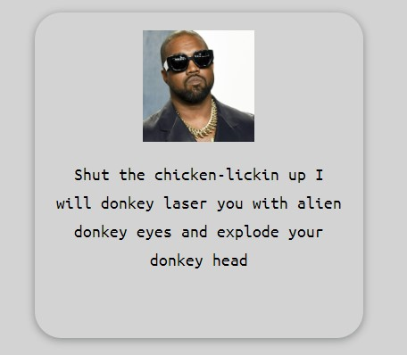
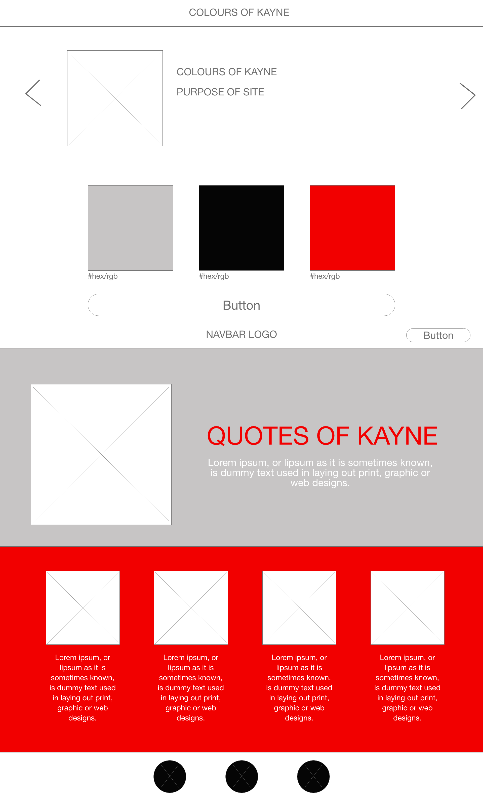
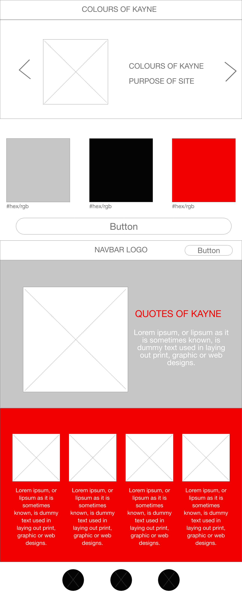
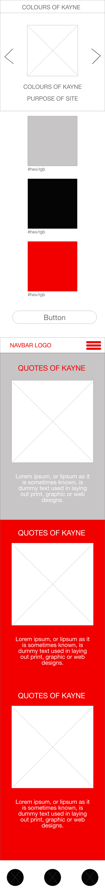

# Colours of Kanye

Hackathon project April 28-29 - Create a web application using HTML, CSS, JavaScript and calls to Web APIs.

## Deployed Site Link

https://sensational-granita-0203fd.netlify.app/

## Repository link

https://github.com/AnderDevitt/colours-of-kanye

## Team Members GitHub links

Team Pokemasters

- **Matilda Morton** [https://github.com/matildamort](https://github.com/matildamort)
- **Simon Tanna** [https://github.com/simon-tanna](https://github.com/simon-tanna)
- **Jason Sandeman** [https://github.com/jwsandeman](https://github.com/jwsandeman)
- **Cameron Jones** [https://github.com/jwsandeman](https://github.com/iamcrjones)
- **Andrew Devitt** [https://github.com/AnderDevitt](https://github.com/AnderDevitt)

## Purpose of the application

The purpose of the Colours of Kanye application is to generate a colour scheme of complimentary colours for web design projects, and to make you laugh.

Many of us have not studied colour or design, and may have trouble choosing colours that will work together in our projects. The app will randomly generate a pallet with three complementary colours.

## Feature list

- **Random Colour Pallet Generater**: This feature uses two APIs. First, a random colour is generated in one API. This colour is then passed to the second API, which matches it with two other colours which should complement it when used together.

- **Kanye Quotes**: The app will receive and display 5 random quotes from the Kanye Rest API and display them on the page. Why? Because we all need a laugh when we're busy, and Kanye is cooler than cat videos. We're sure you'll agree after using our site.

- **Naughty Word Filter**: We needed to make this PG. So we've coded a filter to check each quote and replace the words we can't print in class with some funny options.
  

- **Random Kanye Images**: Each quote is acompanied by a random Kanye image to enhance your enjoyment and brighten your day.

- **Get Inspired by Kanye**: We did. You will.

## Wireframes

### Computer

### Tablet

### Phone

## Screenshots

## Tech stack

The project requirements were to code an app/web app using HTML, CSS, JavaScript and web APIs.

### Coding:

- HTML
- CSS
- JavaScript

### API:

- Kanye Rest API [https://kanye.rest](https://kanye.rest/)
- Random Colour API [http://api.creativehandles.com/getRandomColor](http://api.creativehandles.com/getRandomColor)
- Colour Scheme API [https://www.thecolorapi.com/scheme?hex=${dataCol}&format=jsons&mode=triad&count=3](https://www.thecolorapi.com/scheme?hex=${dataCol}&format=jsons&mode=triad&count=3)

### Organisation and teamwork

- Trello
- Git and GitHub

## Things we learned from this project

### Git and GitHub

We have learnt a lot the last two days about using source control when working as a team.

We also got used to solving mistakes (like accidentally working in the main branch) and managing conflicts when making pull requests. It was also very interesting reviewing and discussing everyone's code before merging.

### Project management

Using Trello to organise our work, we created tickets with randomized ticket-numbers for tasks, then our working branches with the numbers and descriptions for the tasks.

### Coding

Working as a team has been an invaluable experience for all of us. At the beginning we each felt nervous about this first team project, but the atmosphere in the room as we planned and developed this site was energizing. Each member definitely has their strengths to bring to the project. This also gave us a great opportunity to learn from others and see different approaches to coding problems that we can use ourselves.

### Teamwork

It can't be overstated how important it is when working with others on a project to be able to fit in with a team. Some of the things we achieved:

- Creating a shared vision: the project idea and plan was a group effort developed through discussion and brainstorming
- Helping others: Throughout the project, everyone was ready to assist with troubleshooting and giving help. Members shared their strengths with the team to keep the project flowing.
- Hybrid teamwork: Four members of the team were in the same workroom and the fifth was working remotely from another city. It was important to us that our team have the same vibe and energy, and strong communication, so we made sure to keep the contact up throughout the two days.

## A note on the colour APIs

The original colour APIs chosen for the project did not produce useable output that could change the colours on the DOM. The APIs used for the project were a workaround to demonstrate the concept of the site. Therefore you will notice that while the colours displayed do work together, they are often colours which you would not choose for a web project.
